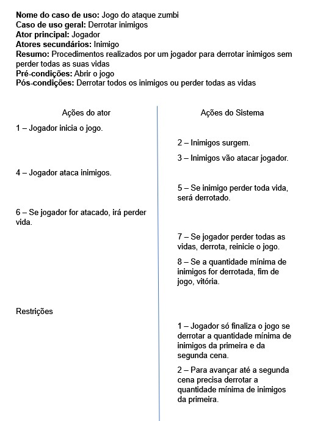
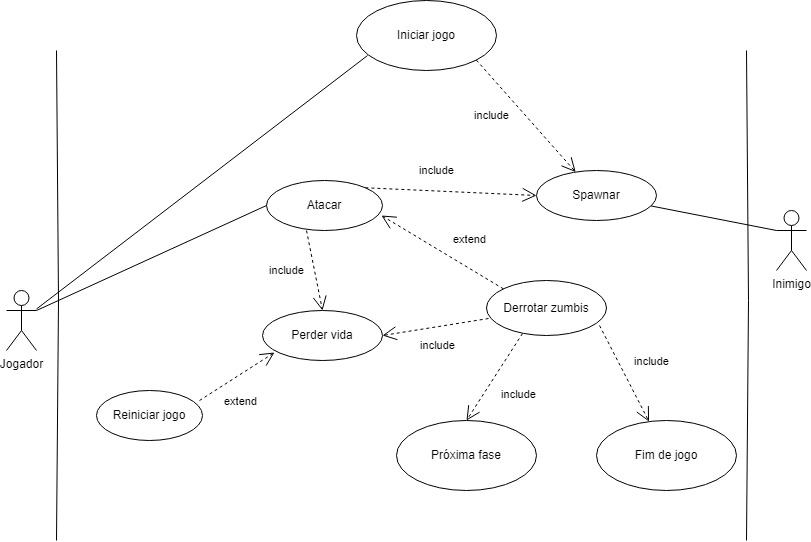
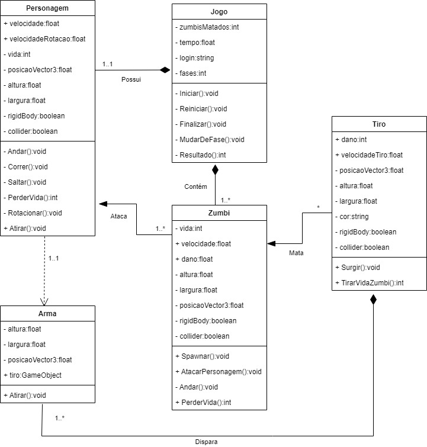

# Diagramas-Unity
Diagramas do jogo no Unity feito por Cauã Silva e Juliana

## Explicação jogo
O jogador irá iniciar o jogo, após iniciar, diversos zumbis irão começar a ir atrás do jogador, uns mais fracos e outros mais forte. O jogador deve sobreviver matando os zumbis, quando ele matar todos, mudará de fase.

## Documentação do caso de uso

## Casos de uso

## Diagrama de classes
